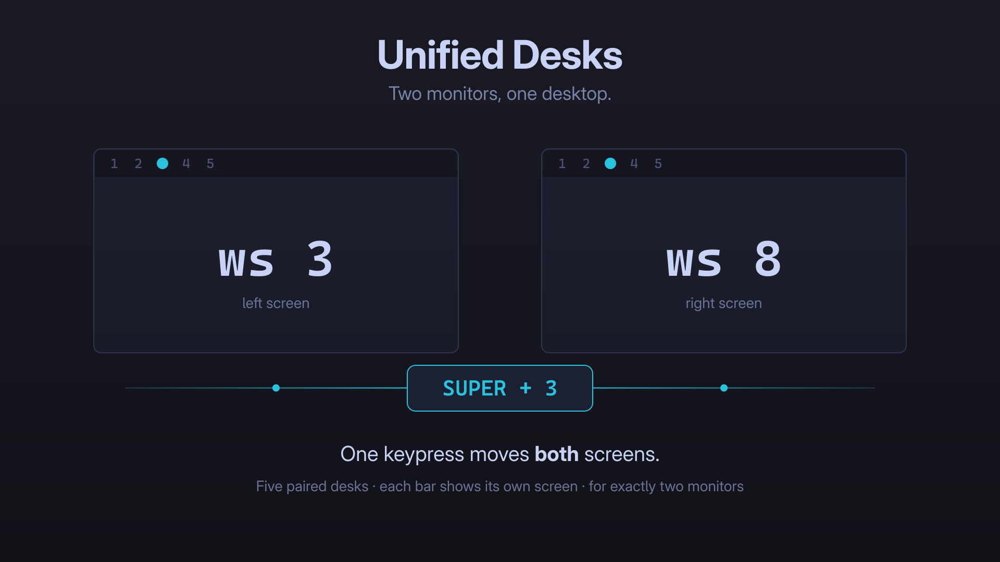

# Unified Desks

**Two monitors, one desktop.**



Every other multi-monitor workspace plugin for Omarchy splits your screens
apart — each monitor gets its own independent workspaces. This one joins them.

`SUPER+1` … `SUPER+5` move **both** monitors at once. A *desk* is a pair of
workspaces: the left screen gets workspace N, the right gets N+5. Switch a desk
and your whole two-screen scene changes together, instead of one half of it.

```
SUPER+1  ->  left: ws 1    right: ws 6
SUPER+2  ->  left: ws 2    right: ws 7
SUPER+3  ->  left: ws 3    right: ws 8
SUPER+4  ->  left: ws 4    right: ws 9
SUPER+5  ->  left: ws 5    right: ws 10
```

## ⚠ For exactly two monitors

This plugin is built for a **two-monitor** setup — it was written for a pair of
side-by-side ultrawides. With any other number of displays the desk model
**switches itself off**: no workspace rules are written, and every workspace key
falls straight through to plain, stock Hyprland behaviour, so `SUPER+3` simply
goes to workspace 3. The bar widget shows a dimmed `2✕` badge so you know why.

The monitor count is re-checked on every keypress, not just at startup, so
unplugging a display stands the desks down instantly and plugging one back in
brings them straight back — no reload, and never a moment without working
workspace keys.

## Why not just make one workspace span both screens?

You cannot, and it is worth knowing why before you install this.

Hyprland binds every workspace to exactly one monitor — that is structural, not
a setting. The only way to get a genuinely spanning workspace is to have the GPU
present both panels as a single output (NVIDIA Surround), which does not work on
Linux. Even `hyprland-virtual-desktops`, built for this exact wish, states that
windows cannot span monitors.

So a truly unified workspace is off the table. What *is* achievable is moving
both monitors as one unit, which is what this does. Individual windows still
cannot straddle the bezel while tiled.

## What it changes

| File | Change |
|---|---|
| `~/.config/hypr/unified-desks.lua` | Installed from the plugin payload |
| `~/.config/hypr/hyprland.lua` | One fenced `require()` block |
| Bar | Adds the Unified Desks widget |

Originals are copied to `~/.local/state/io.github.azcoov.unified-desks/originals/` before
anything is touched.

### Keybindings

| Key | Action |
|---|---|
| `SUPER + 1..5` | Switch both monitors to desks 1–5 |
| `SUPER + 6..0` | Switch to the desk that workspace belongs to (6→desk 1 … 0→desk 5) |
| `SUPER + SHIFT + N` | Move window to that desk, on the screen it is already on |
| `SUPER + SHIFT + ALT + N` | Same, without following it |

Any workspace key takes you to the **desk containing that workspace**, so
`SUPER+7` and `SUPER+2` both land on desk 2. Workspaces 6–10 are the right-hand
halves of a desk, and reaching one on its own would desynchronise the pair —
which is exactly the confusion this plugin removes.

`SUPER + SHIFT + N` is rebound for a reason: the stock binding always targets
workspace N, so pressing it on the right monitor would fling the window to the
left screen. Here it targets whichever half of the desk you are already on.

### Losing a monitor

All ten keys stay bound whatever the monitor count. If a display is unplugged,
the desk model switches off and every key falls back to plain, stock workspace
behaviour — so you are never left without working workspace keys. Plug the
second monitor back in and desks resume.

## The bar widget

Shows **5 desks**, not 10 workspaces. Clicking one switches both monitors, the
same as the keybinding.

It also fixes a real bug in the stock widget. Omarchy's `omarchy.workspaces`
highlights `Hyprland.focusedWorkspace`, a *global* value, so on two monitors both
bars draw the same cell and one of them is lying. This widget resolves each bar's
own monitor and derives the desk from that monitor's active workspace — so the
two bars agree when desks are in sync, and honestly differ when they are not.

A desk lights up as occupied if **either** half holds windows.

## Install

```bash
omarchy plugin add https://github.com/azcoov/omarchy-unified-desks.git --enable
```

Then put the widget in your bar — it defaults to the left section, replacing the
stock workspace indicator.

## Uninstall

```bash
~/.config/omarchy/plugins/io.github.azcoov.unified-desks/scripts/desks-ctl restore
omarchy plugin remove io.github.azcoov.unified-desks
```

`restore` strips the fenced block from `hyprland.lua`, removes
`unified-desks.lua`, and reloads Hyprland. Your originals remain in
`~/.local/state/io.github.azcoov.unified-desks/originals/`.

## Conflicts

This plugin owns workspace bindings and workspace-to-monitor rules. Do not run it
alongside plugins that claim the same ground:

- `im0001gt.screens` with **workspace spreading enabled**. Turn spreading off
  (`manageWorkspaces`) — with it on, Screens writes its own `workspace_rule`
  entries into `monitors.lua` and the two plugins fight over the same rules.
  Unified Desks loads last so its rules win, but you are left with duplicates.
  Screens also replaces the bar's workspace widget on install, so re-select
  Unified Desks in `shell.json` afterwards.
- `chagel.workspace-tags` with per-monitor tags enabled
- `mmsbrggr.per-monitor-workspaces`, `shameel.workspaces`,
  `ragnacron.workspaces-per-monitor`, `ziryt.split-workspaces`, and similar
  per-monitor workspace plugins — they implement the opposite philosophy

## Troubleshooting

```bash
~/.config/omarchy/plugins/io.github.azcoov.unified-desks/scripts/desks-ctl status
```

Reports monitor count, whether the Lua file and hook are installed, and how many
workspace rules are active.

If the bar reverts to showing ten workspaces, another plugin reclaimed the
widget slot — set the left widget id back to `io.github.azcoov.unified-desks` in
`~/.config/omarchy/shell.json`.

## Requirements

- Omarchy with the shell plugin CLI
- Hyprland 0.55+ with Lua config
- `jq`, `python3`
- Exactly two monitors

## License

MIT
